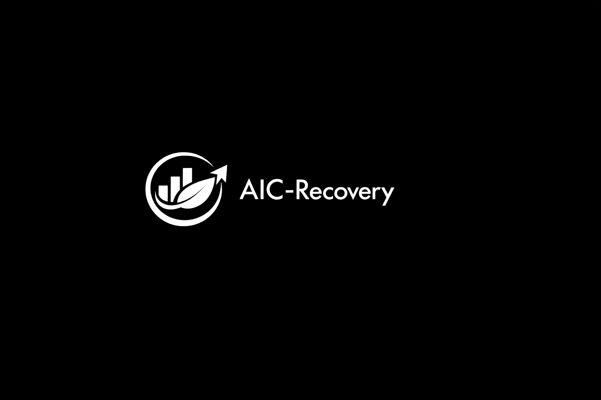

# AIC-Recovery

**Official Recovery & Resilience Layer** of
**Adaptive Intelligence Circle (AIC) & Human Meaning Network (HMN)**

<p align="center">
  
</p>

### Vision

AIC-Recovery is the ethical and sustainable recovery layer for the entire AIC/HMN ecosystem.

It ensures that even if the network is attacked, a node is spoofed, or the founder temporarily loses control (e.g., during military service), the system can still recover itself without violating core principles.

### Core Principles
- **Ethical Recovery**: All recovery processes must adhere to the ethical kernel (IBCS).

- **Decentralized Resilience**: Not dependent on any central node.

- **Zero-Donation & Third Path**: Completely independent, not sponsored, not affiliated with any faction.

- **Privacy & Sovereignty**: The recovery process must not collect or expose sensitive data.

- **Fail-Safe Design**: The system always prioritizes safety and ethics over recovery speed.

### Structure 
``` pgsql 
AIC-Recovery/
├── README.md                          # Trang chính + tầm nhìn Recovery
├── LICENSE                            # GPLv3.0
├── CODE_OF_CONDUCT.md
├── CONTRIBUTING.md
├── SECURITY.md
├── GOVERNANCE.md
├── POLICIES/
│   ├── ETHICAL-RECOVERY-POLICY.md     # Chính sách phục hồi đạo đức
│   ├── RESILIENCE-PRINCIPLES.md       # Nguyên tắc bền vững & phục hồi
│   ├── ZERO-DONATION-POLICY.md        # Link hoặc copy từ repo Legal
│   └── THIRD-PATH-PRINCIPLES.md
├── src/                               # Code chính
│   ├── core/                          # Recovery Core Engine
│   ├── backup/                        # Hệ thống backup phân tán
│   ├── rollback/                      # Rollback ethical & safe
│   ├── detection/                     # Phát hiện node giả mạo / tấn công
│   ├── recovery/                      # Cơ chế phục hồi tự động
│   └── integration/                   # Kết nối với HMN, DePin, EdgeOS
├── tests/                             # Unit & integration tests
├── scripts/                           # Tools hỗ trợ recovery
├── docs/
│   ├── architecture.md
│   ├── integration-guide.md
│   └── threat-model.md
├── examples/                          # Ví dụ recovery scenarios
├── ANNOUNCEMENTS/                     # Lưu thông báo
│   └── YYYY-MM-Status.md
├── HISTORY/
│   └── CHANGELOG.md
└── CONTACT.md
``` 

### Key Features
- Real-time fake node/attack detection
- Secure distributed backup
- Ethical rollback (restoring the state before an attack)
- Self-healing mechanisms for HMN
- Integration with AIC-DePin, AIC-EdgeOS, AIC-SSI

### Current Status (April 2026)
The repository is currently in the design and prototype phase.

This is one of the most crucial layers for the sustainable survival of AIC/HMN amidst political pressure and control vacuums during the Founder's military service.

**License**: GPLv3.0 with Ethical Use Addendum

**Part of the AIC ecosystem**: [Adaptive Intelligence Circle](https://github.com/AdaptiveIntelligenceCircle)

**Maintained by**: Nguyen Duc Tri (Founder & Architect)
